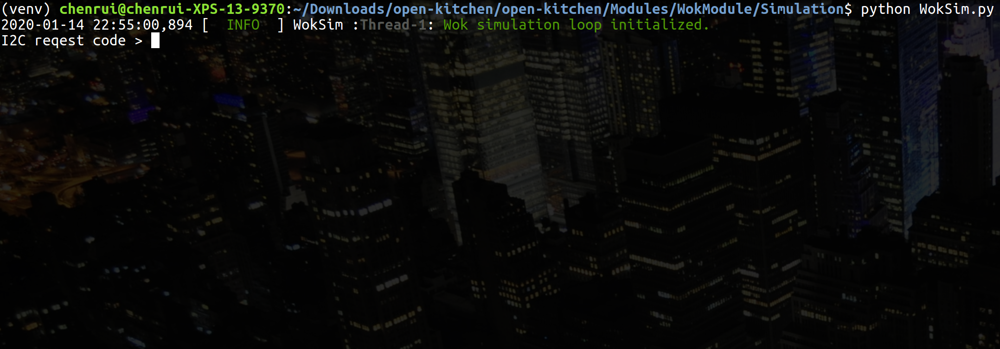
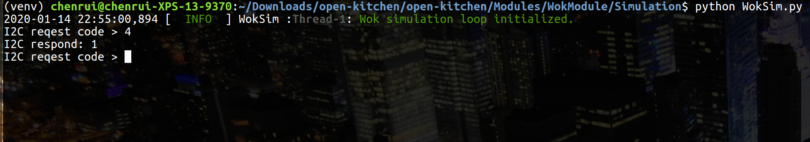
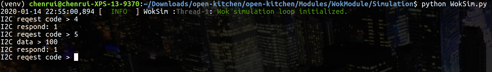
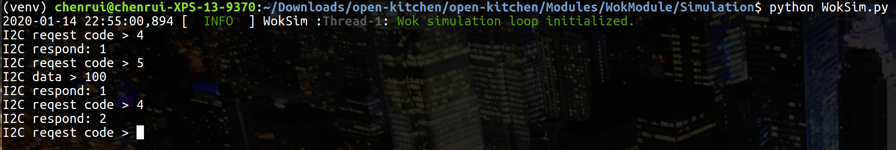
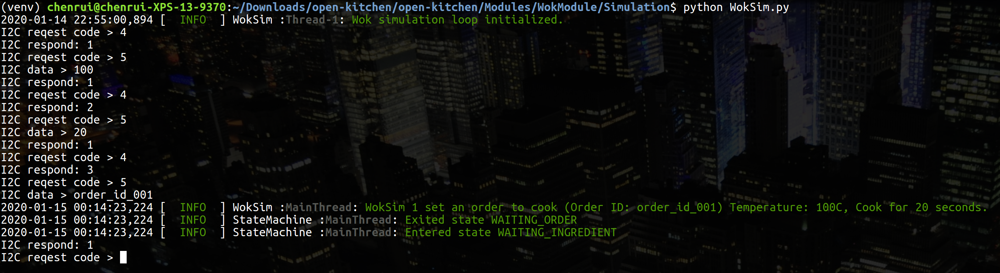
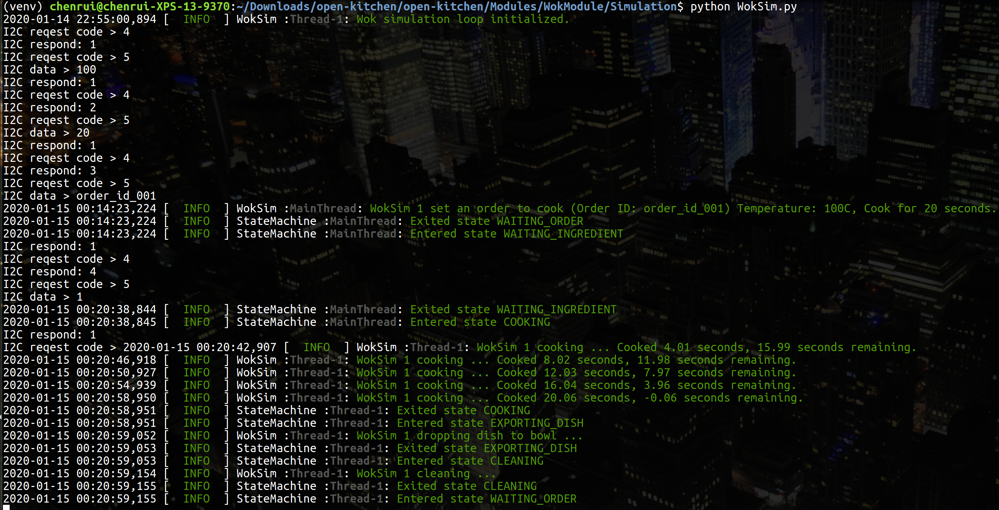
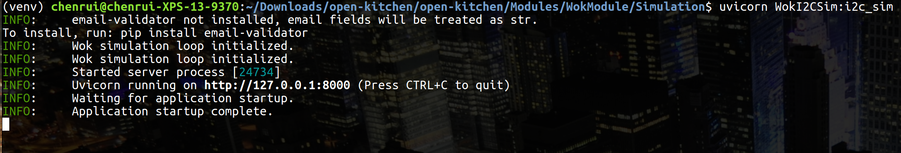
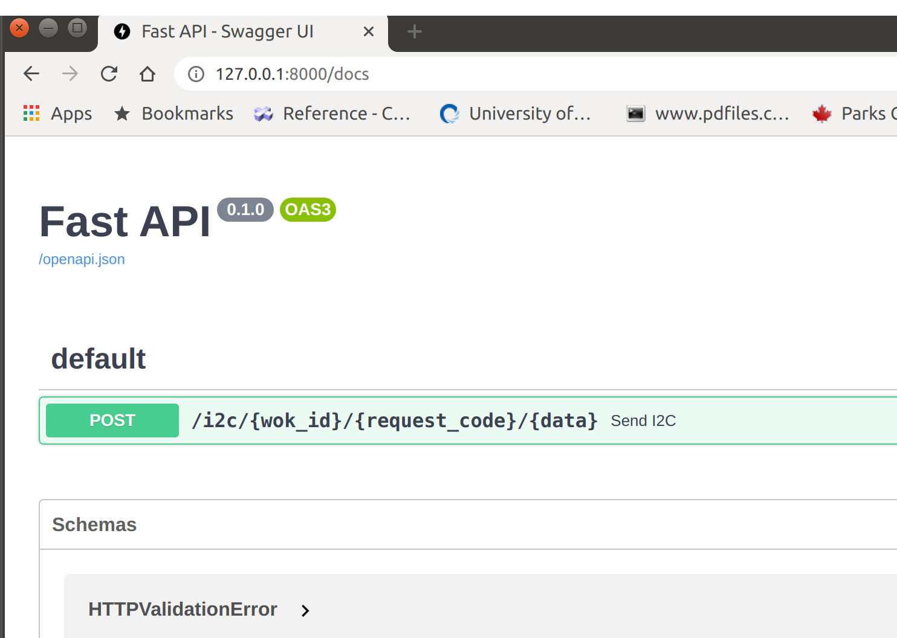
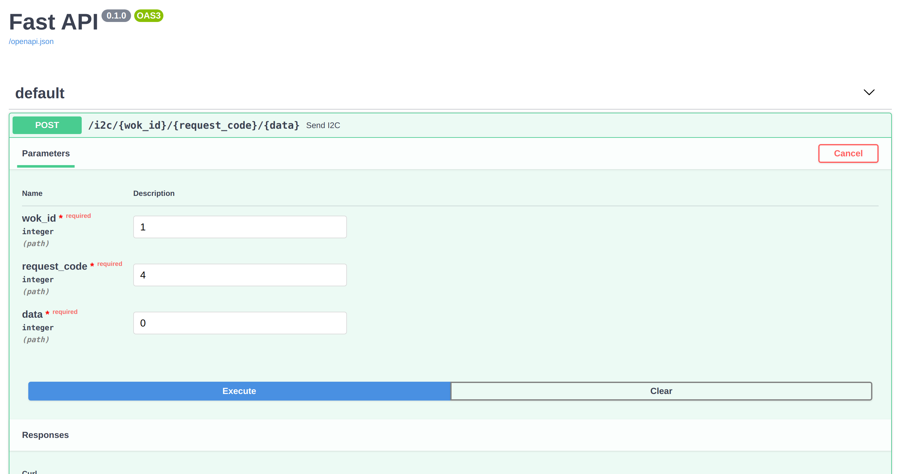
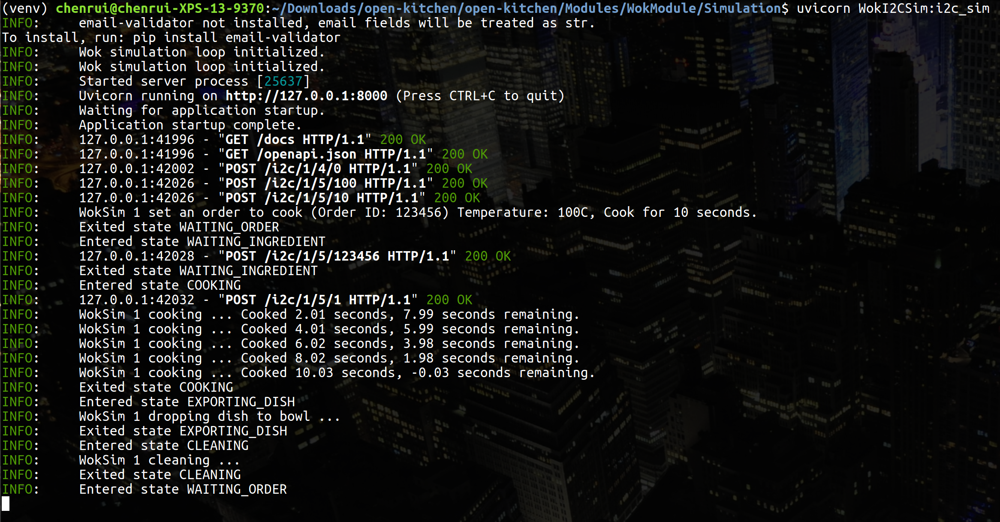

# Wok Simulation

This Wok simulation contains two parts:

1. **WokSim**: the core hardware level - single wok simulation
2. **WokI2CSim**: the Wok(s) simulation on the simulated I2C interface


# Virtual Environment Setup

You will need to setup a virtual environment to run the wok simulation. The instructions to how setup a python
 virtual environment using virtualenv are the following: 
 
```bash
virtualenv <environment_name>           # Create virtual environment
source ./<environment_name>/bin/active  # Activate virtual environment
pip install -r requirements.txt         # Install requirement at runtime
pip install -r requirements-dev.txt     # Install requirement for development
```

The `requirements.txt` and `requirements-dev.txt` are stored in the main root directory of this repository.

Once the virtual environment has been setup, follow the directory `Modules/WokModule/Simulation` in this repository to initiate a Wok simulation.

# Wok Behavior

The WokSim is the core of hardware-level, single wok simulation. It simulates the behavior of a wok which will only
 receive I2C requests from the main controller (Raspberry Pi) and respond based on which requests have been sent from the main
  controller. The overall workflow cycle of the Wok component is explained in the next 6 points:

1. The Wok will initialize in the `waiting order` state, which will
    - Wait for the main controller to set the cooking heat temperature.
    - Wait for the main controller to set cooking duration in seconds.
    - Wait for the main controller to pass down the order id.
2. After the above parameters are set, the Wok goes into the `waiting ingredients` state which will
    - Wait for the main controller to notify if the ingredients are in the Wok.
3. Once the main controller confirm the ingredients have been put in the Wok, it goes into the `cooking` state which will
    - Heat the Wok to the temperature configured and cook for the duration in seconds previously set.
4. Once the cooking time has passed, the Wok will enter the `dispensing food` state which will
    - Drop the Wok content (food) into the bowl.
5. Finally, the Wok will go to the `cleaning` state after dropping the dish into a bowl. It will 
    - Clean itself
6. The Wok will cycle back to the first step

The Wok also supports changes to the cooking time and temperature in the middle of the `cooking` state, if so, it will reset the Wok.


# WokSim CLI
 
WokSim can be executed in the terminal with the following command ( you have to be in the same directory as the `WokSim.py` ),

```bash
python WokSim.py
```

After you run the previous command, you should see something like the following screenshot,


Now, you can send requests as the main controller to control the Wok. Every time you send a
 request, the Wok should respond with a code number. The following table shows the request types that can be done and the possible responses:
  
#### Main controller to Wok 
| Request code | Request Description | Data  | Response | Response Description
|:-------------|:--------------------|:------|:---------|:--------------------
| 1            | Get component code  |       | 1        | Wok component
|              |                     |       | 2        | Ingredient dispenser component
|              |                     |       | 3        | Sauce runner component
|              |                     |       | 4        | Transporter (Conveyor) component
| 2            | Get state code      |       | 1        | Waiting for order state
|              |                     |       | 2        | Waiting for ingredient state
|              |                     |       | 3        | Cooking state
|              |                     |       | 4        | Dispensing food state
|              |                     |       | 5        | Cleaning state
| 3            | Get error code      |       | 0        | No errors
|              |                     |       | 1        | Error: cooking interrupted before cooking time is complete
|              |                     |       | 2        | Error: bowl is not in place for food dispensing
| 4            | Get Wok request code|       | 0        | Wok no request
|              |                     |       | 1        | Wok request to set up heating temperature (℃)
|              |                     |       | 2        | Wok request to set cooking duration (s)
|              |                     |       | 3        | Wok request to set order id 
|              |                     |       | 4        | Wok request to notify if ingredients were dispensed inside Wok
| 5            | Respond Wok request | uint8 | 0        | Wok failed to save data and/or not able to setup
|              |                     |       | 1        | Wok successfully save data and/or setup
| 6            | Reset Wok           |       | 0        | Wok failed to reset
|              |                     |       | 1        | Wok successfully reset
| 7            | Reset cooking time  | uint8 | 0        | Wok failed to reset cooking duration
|              |                     |       | 1        | Wok successfully reset cooking duration
| 8            | Reset wok temperature| uint8 | 0        | Wok failed to reset cooking temperature
|              |                     |       | 1        | Wok successfully reset cooking temperature 


The following table represents the request types from the Wok to the main controller (Raspberry pi) and the meanings of each one of them.

#### Wok to the main controller
| Request code | Request Description                     | Data  | Response | Response Description
|:-------------|:----------------------------------------|:------|:---------|:--------------------
| 0            | No request                              | 
| 1            | Request to set heating temperature (℃)  |       | uint8    | Heat degrees
| 2            | Request to set cooking duration (s)     |       | uint8    | Cooking duration in seconds
| 3            | Request to set order id                 |       | string   | Order id
| 4            | Request to confirm dispensed ingredients|       | 0        | Denied                    
|              |                                         |       | 1        | Confirmed
| 5            | Request to confirm if wok is empty      |       | 0        | Denied 
|              |                                         |       | 1        | Confirmed

Therefore, we can use the I2C request code `4` to check the Wok request code. So, if you type 4 in the WokSim command line and hit
 enter, you should see the following: 
 
 
 As you can see, the WokSim response is `1`, which means the Wok is requesting us to set the heating temperature (℃). We can 
 use I2C request code `5` to respond to the Wok's temperature request. You will notice that the command line will request an input of I2C data if we use I2C request code `5`. The unit 100 in entered on the following example: 
 
 
 The WokSim respond is `1` to the heating temperature data input, so the heating temperature has been succesfully set up. 
  Now if you check the Wok request by using I2C request code `4`, you should find that the response changed to `2` which
  means that the Wok is requesting us to set the cooking duration in seconds.
 
 
 You can repeat the same steps as before but now we need to do the duration and the order id, to do that, we need to send the
 request code `5` to setup the cooking duration and order id. After you finish setting up those
  three parameters, the Wok should enter `waiting ingredients` state and you should see the screen below:
 
 
 Now, the Wok will remain in a waiting state until you confirm that the ingredients are in the Wok. You can confirm that using 
 request code `5` and doing a data input = `1`. Then, you should see WokSim moves to the `cooking` state. After the cooking 
 time is up, it will go through the `dispensing food` state and `cleaning` state and that's the last state in the loop, which 
 means that it will go back to `waiting order` state automatically. The screen that you will see should be similar as the one 
 below.
 
 
 Now, you can go over the same process to simulate another dish repeating all the steps above. 
 
 Note: You can type in `stop` in the I2C simulation terminal to exit the WokSim process.
  
  
# WokI2CSim

WokI2CSim is an extension of the WokSim which uses a RESTful API to simulate the I2C communication that offers to communicate with multiple Woks. WokI2CSim will only simulate 2 Woks at this point. 
 
To start up, you need to go to the same directory where the file `WokI2CSim.py` is located and run the following command:
```bash
uvicorn WokI2CSim:i2c_sim
```

You should see something like this when it's up and running:
 
 
If the port is available the RESTful API will open at `127.0.0.1:8000` by default and the user interface should be available 
if you visit `http://127.0.0.1:8000/docs`. 
 
 
Then, you should able to control the Wok using the same process explained above (WokSim). You can select `1` or `2` as the 
`wok_id`. Also, you must put `0` in the data field if a request doesn't require to input any data.
 
 
Each response in this RESTful API simulation will contain helper fields that translates the raw request and the raw response
into a more human friendly message to understand what is going on easily. For
 example: 
 
 ```json
{
  "wok_id": 1,
  "raw_request": 4,
  "raw_response": 1,
  "request_description": "request wok action",
  "response_description": "The Wok request to set cooking temperature."
}
```

 
Here is what you should see if you did setup the Wok #1 to cook at the temperature of 100 ℃ for 10 seconds.
 
  
  
  
# Human Friendly Simulation

You can using the following command to launch a human friendly simulation with a RESTful API interface at `http://127
.0.0.1:8000/docs`,
```bash
uvicorn WokI2CSim:pi_sim
```

The UI should look like the screenshot below,


# The End
That's how you can use Wok simulation.
