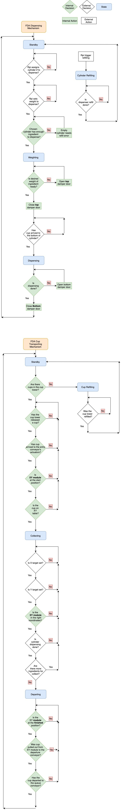
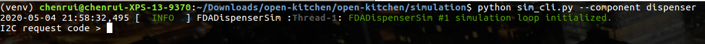
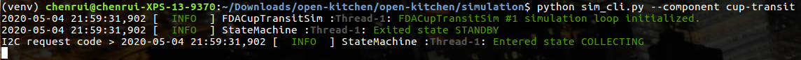
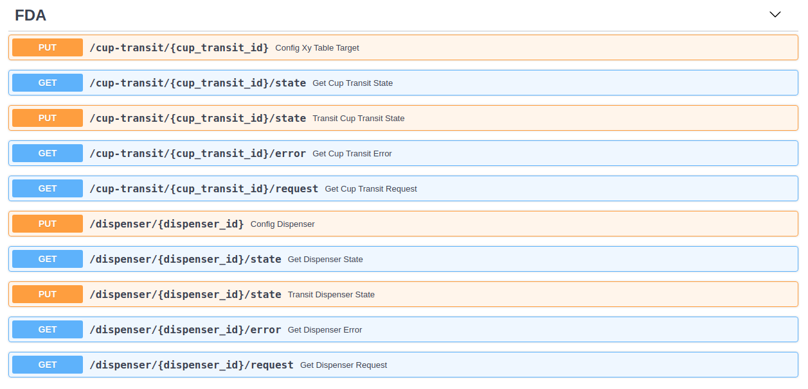

# Food Dispensing Assembly (FDA) Simulation

This FDA simulation contains two parts:

1. **fda_sim**: the core hardware level - single FDA simulation
2. **fda_sim_interface**: the FDA(s) simulation on the simulated I2C interface


# Virtual Environment Setup

You will need to setup a virtual environment to run the simulation. The instructions to setup a python
 virtual environment using `virtualenv` are as following:

```bash
virtualenv <environment_name>           # Create virtual environment
source ./<environment_name>/bin/active  # Activate virtual environment
pip install -r requirements.txt         # Install requirement at runtime
pip install -r requirements-dev.txt     # Install requirement for development
```

The `requirements.txt` and `requirements-dev.txt` are stored in the root directory of this repository.

Once the virtual environment has been setup, follow the directory `simulation` in this repository to initiate a
 simulation.

# FDA Behavior

### FDA States

The **FDA Dispensing Mechanism** will have the following states

| State code | Description                |
|:-----------|:---------------------------|
| 1          | Standby                    |
| 2          | Weighting                  |
| 3          | Dispensing                 |
| 4          | Cylinder Refilling         |

The **FDA Cup Transportation Mechanism** will have the following states

| State code | Description                |
|:-----------|:---------------------------|
| 1          | Standby                    |
| 2          | Collecting                 |
| 3          | Departing                  |
| 4          | Cup Refilling              |

### FDA Errors

| Error code | Description                |
|:-----------|:---------------------------|
| 0          | No errors                  |
| 1          | Desire cylinder need refill|
| 2          | Cup tower empty            |

### Workflow

The fda_sim is the core of hardware-level, single FDA simulation. It simulates the behavior
 of a FDA Dispenser and FDA Cup Transit which will only receive I2C requests from the main controller
 (Raspberry Pi) and respond based on which requests have been sent from the main controller.


**FDA Dispensing Mechanism**

The overall workflow cycle of the FDA Dispensing Mechanism is explained in the next 7 points:

      1. The FDA Dispensing Mechanism will initialize in the `STANDBY` state, in which the main
         controller is to set
          - The cylinder ID number
          - The weight each cylinder is to dispense

      2(a). After the above parameters are set, and only if the desire ingredient load is greater than 20%,
         the FDA Dispensing Mechanism goes into the `WEIGHTING` state, in which the mechanism
           - Opens up the top damper door - simulateneously weighting the ingredient - and then closes the
           same damper door once the desire weight of ingredient is reached.
           - Then Waits for the main controller to notify if the cup has arrived below the cylinder.

      2(b). After the above parameters are set, and if the desire ingredient load is not greater than 20%,
         the FDA Dispensing Mechanism goes into the `REFILLING` state, in which it will
           - Wait for main controller to notify if the refilling is done.

      3(a). Once the main controller confirms that a cup has arrived below the target cylinder, it goes into
          the `DISPENSING` state, in which the mechanism
            - Dispenses the weighted ingredient of the cylinder into the cup.

      3(b). Once the main controller notifies that refilling is completed, the FDA Dispensing Mechanism goes
          back to `STANDBY` state (cycle back to the first step).

      4(a). Finally, the FDA Dispensing Mechanism will cycle back to the first step into the `STANDBY` state.


**FDA Cup Transporting Mechanism**

The overall workflow cycle of the FDA Cup Transporting Mechanism is explained in the next 5 points:

      1. The FDA Cup Transporting Mechanism will initialize in the `STANDBY` state which will
           - Check for available cups in the cup tower.
           - Trigger to release a cup if there is any available, or call to refill cup otherwise
           (go to step 1(b)).
           - Move cup to the conveyor's actuator.
           - Move XY table to the start position.
           - Place the cup on XY table.

      1(b). If there is not cup in the cup tower then the FDA Cup Transporting Mechanism goes into the
           `CUP REFILLING` state which will
            - Wait for main controller to notify if the cup refilling is done.

      1(c). Once the main controller notifies that cup refilling is done, FDA Cup Transporting Mechanism
          goes back to `STANDBY` state (cycle back to the first step).

      2(a). After the operations above, the FDA Cup Transporting Mechanism goes into the `COLLECTING` state
           which will
           - Wait for the main controller to set XY coordinates.
           - Move XY table to the target coordinates.
           - Wait for the main controller to notify if the cylinder dispensing is done.
           - Ask main controller if there is more ingredients to collect. Repeat step 2(a) if there is more
           ingredients to collect.

      3(a). Once the FDA Cup Transporting Mechanism collects all the ingredients, it goes into the
           `DEPARTING` state which will
            - Move XY table to the exit position.
            - Pull out the cup from XY table to the departure conveyor.
            - Move the cup with ingredients to the queue conveyor.

      4. Finally, the FDA Cup Transporting Mechanism will cycle back to the first step into the
         `STANDBY` state.


### Workflow Diagram
You can check the following diagram for the FDA simulation workflow described above,




# FDA CLI

FDADispenserSim can be executed in the terminal with the following command ( you have to be in the same directory as the
 `sim_cli.py` ),

```bash
python sim_cli.py --component dispenser
```

FDACupTransitSim can be executed in the terminal with the following command ( you have to be in the same directory as
 the `sim_cli.py` ),

```bash
python sim_cli.py --component cup-transit
```

After you run the previous command, you should see something like the following screenshots,


**FDA Dispensing Mechanism**




**FDA Cup Transporting Mechanism**



Now, you can send requests as the main controller to control the FDA. Every time you send a
 request, the simulation should respond with a code number. The following table shows the request types that can be done
  and the possible responses:

#### Main controller to FDA
| Request code | Request Description | Data type | Data Description | Response type | Response Description
|:-------------|:--------------------|:----------|:-----------------|:--------------|:--------------------
| 1            | Get component code  |           |                  | uint8         | Refer to Component codes
| 2            | Get state code      |           |                  | uint8         | Refer to [FDA States](#fda-states)
| 3            | Get error code      |           |                  | uint8         | Refer to [FDA Errors](#fda-errors)
| 4            | Get FDA request code |          |                  | unit8         | Refer to request code column at [FDA to the main controller requests](#fda-to-the-main-controller)
| 5            | Respond FDA request | uint8     |                  | uint8         | Refer to the response column at [FDA to the main controller requests](#fda-to-the-main-controller)
| 6            | (Re)Set dispensing cylinder# | uint8 | Cylinder#   | unit8         | Denied (0) or Confirmed (1)
| 7            | (Re)Set dispensing weight | uint8 | Weight (grams) | uint8         | Denied (0) or Confirmed (1)
| 8            | Notify cup's arrival under cylinder | uint8 | True (1) or False (0) | uint8         | Denied (0) or Confirmed (1)
| 9            | Trigger dispensing cylinder into refilling state | uint8 | True (1) or False (0) | uint8         | Denied (0) or Confirmed (1)
| 10           | (Re)Set target X   | uint8 | Y target for XY-table | uint8         | Denied (0) or Confirmed (1)
| 11           | (Re)Set target Y   | uint8 | X target for XY-table | uint8         | Denied (0) or Confirmed (1)
| 12           | Notify if there are more ingredients to collect| uint8 | True (1) or False (0) | uint8    | Denied (0) or Confirmed (1)
| 13           | Notify cup tower refill is done | uint8 | Number of cups been refilled to the cup tower| uint8         | Denied (0) or Confirmed (1)


The following table represents the request types from the FDA to the main controller (Raspberry pi) and the
 meaning of each one of them.

#### FDA to the main controller
| Request code | Request Description                     | Data type | Data Description | Response type | Response Description
|:-------------|:----------------------------------------|:----------|:-----------------|:--------------|:--------------------
| 0            | No request                              |
| 1            | Request to set dispensing cylinder#     | uint8     | Cylinder#        | 0             | Denied (0) or Confirmed (1)
| 2            | Request to set dispensing weight        | uint8     | Weight (grams)   | 0             | Denied (0) or Confirmed (1)
| 3            | Request to notify if cup is arrived     | uint8     | True (1) or False (0) | 0        | Denied (0) or Confirmed (1)
| 4            | Request to notify if cylinder refill is done| uint8 | True (1) or False (0) | 0        | Denied (0) or Confirmed (1)
| 5            | Request to set target X                 | uint8     | X target for XY-table | 0        | Denied (0) or Confirmed (1)
| 6            | Request to set target Y                 | uint8     | Y target for XY-table | 0        | Denied (0) or Confirmed (1)
| 7            | Request to notify if there is more ingredients to collect|uint8|True (1) or False (0)|0 | Denied (0) or Confirmed (1)
| 8            | Request to notify if cup tower refill is done | uint8 |  Number of cups been refilled to the cup tower | 0 | Denied (0) or Confirmed (1)
| 9            | Request to notify if cylinder dispense is done | uint8 | True (1) or False (0) | 0     | Denied (0) or Confirmed (1)

 Note: You can type in `stop` in the I2C simulation terminal to exit the simulation process.


# Human Friendly Simulation

You can use the following command to launch a human friendly simulation with a RESTful API interface at `http://127
.0.0.1:8000/docs`,
```bash
python sim_api.py --fda-num <number_of_simulated_fda>
```

You can use the following command to bring up the API interface without specify the FDA quantity. In this case
, the number of simulated wok will set to default value 2.
```bash
python sim_api.py
```

The UI should look like the screenshot below,



# The End
That's how you can use the FDA simulation.
