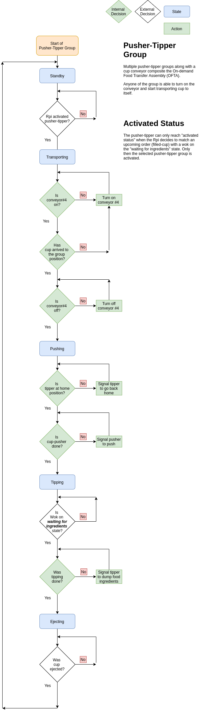
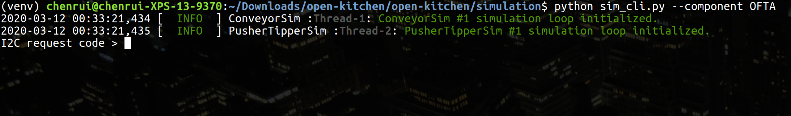
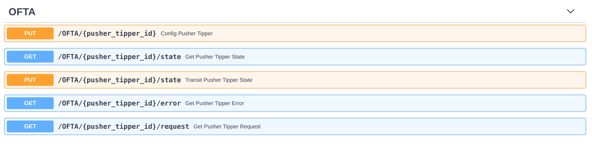

# On-demand Food Transportation Assembly (OFTA) Simulation

This OFTA simulation contains two parts:

1. **pusher_tipper_sim**: the core hardware level - single Pusher-tipper simulation
2. **pusher_tipper_sim_interface**: the Pusher-tipper group(s) simulation on the simulated I2C interface


# Virtual Environment Setup

You will need to setup a virtual environment to run the simulation. The instructions to setup a python
 virtual environment using virtualenv are as following:

```bash
virtualenv <environment_name>           # Create virtual environment
source ./<environment_name>/bin/active  # Activate virtual environment
pip install -r requirements.txt         # Install requirement at runtime
pip install -r requirements-dev.txt     # Install requirement for development
```

The `requirements.txt` and `requirements-dev.txt` are stored in the main root directory of this repository.

Once the virtual environment has been setup, follow the directory `simulation` in this repository to initiate a
 simulation.

# OFTA Behavior

### Pusher-tipper States

The Pusher-tipper will have the following states

| State code | Description                |
|:-----------|:---------------------------|
| 1          | Standby                    |
| 2          | Transporting               |
| 3          | Pushing                    |
| 4          | Tipping                    |
| 5          | Ejecting                   |


### Workflow

The pusher_tipper_sim is the core of hardware-level, single Pusher-tipper group simulation. It simulates the behavior
 of a Pusher-tipper group which will only receive I2C requests from the main controller (Raspberry Pi) and respond
  based on which requests have been sent from the main controller. The overall workflow cycle of the Pusher-tipper
   component is explained in the next 6 points:


1. The Pusher-tipper will initialize in the `STANDBY` state, in which it will
    - Wait for the main controller to activate it. When a cup is assigned to be sent to a wok, the corresponding
    Pusher-tipper group associated with wok gets activated. 

2. After it gets activated, the Pusher-tipper group goes into the `TRANSPORTING` state, in which 
    - The conveyor belt is automatically turned on
    - The cup is then transported in front of the designated Pusher-tipper group.
    - The conveyor belt is then turned off when the cup is detected in front of the Pusher-tipper group

3. Pusher-tipper will enter the `PUSHING` state once the cup has arrived. In this state it will
    - Check for the position of the tipper and make sure it is on the *home* position.
    - Push the cup to the tipper, when tipper is in *home* position.

4. Pusher-tipper will enter the `TIPPING` state once the pushing is done. In thi state it will
    - Check if the Wok is at the *waiting for ingredients* state.
    - Once ready, it will dispense the cup's contents into the designated wok 

5. After dispensing the cup's contents into the wok, the Pusher-tipper group will enter the `EJECTING` state, in which
    - The group will eject the cup from the tipper into the washing area of cups

6. Once the cup has been ejected, the Pusher-tipper will cycle back to `STANDBY` state.


### Workflow Diagram
You can check the following diagram for the Pusher-tipper simulation workflow described above,




# Pusher-tipper CLI

PusherTipperSim can be executed in the terminal with the following command ( you have to be in the same directory as the
 `sim_cli.py` ),

```bash
python sim_cli.py --component OFTA
```

After you run the previous command, you should see something like the following screenshot,


Now, you can send requests as the main controller to control the Pusher-tipper group. Every time you send a
 request, the simulation should respond with a code number. The following table shows the request types that can be done
  and the possible responses:

#### Main controller to Pusher-tipper
| Request code | Request Description | Data  | Response | Response Description
|:-------------|:--------------------|:------|:---------|:--------------------
| 1            | Get component code  |       | 1        | Wok component
|              |                     |       | 2        | Ingredient dispenser component
|              |                     |       | 3        | Sauce runner component
|              |                     |       | 4        | Transporter (Conveyor) component
| 2            | Get state code      |       | 1        | STANDBY state
|              |                     |       | 2        | TRANSPORTING state
|              |                     |       | 3        | PUSHING state
|              |                     |       | 4        | TIPPING runner state
|              |                     |       | 5        | EJECTING state
| 3            | Get error code      |       | 0        | No errors
| 4            | Get Pusher-tipper request code |       | 0        | No request
|              |                     |       | 1        | Request to activate
|              |                     |       | 2        | Request to set Wok is in ready position or waiting for ingredients state
|              |                     |       | 3        | Request to notify when cup ejection is done
| 5            | Respond Pusher-tipper request | uint8 | 0        | Failed to save data and/or not able to setup
|              |                     |       | 1        | Successfully save data and/or setup
| 6            | Activate Pusher-tipper | uint8 | 0        | Failed
|              |                     |       | 1        | Successfully
| 7            | (Re)Set wok is ready | uint8 | 0        | Failed
|              |                     |       | 1        | Successfully
| 8            | (Re)Set ejecting is done | uint8 | 0        | Failed
|              |                     |       | 1        | Successfully


The following table represents the request types from the Pusher-tipper to the main controller (Raspberry pi) and the
 meanings of each one of them.

#### Pusher-tipper to the main controller
| Request code | Request Description                     | Data  | Response | Response Description
|:-------------|:----------------------------------------|:------|:---------|:--------------------
| 0            | No request                              |
| 1            | Request to be activated                 |       | 0        | Denied
|              |                                         |       | 1        | Confirmed
| 2            | Request to confirm if wok is ready      |       | 0        | Denied
|              |                                         |       | 1        | Confirmed
| 3            | Request to confirm if ejecting is done  |       | 0        | Denied
|              |                                         |       | 1        | Confirmed

 Note: You can type in `stop` in the I2C simulation terminal to exit the simulation process.


# Human Friendly Simulation

You can use the following command to launch a human friendly simulation with a RESTful API interface at `http://127
.0.0.1:8000/docs`,
```bash
python sim_api.py --wok-num <number_of_simulated_wok>
```

You can use the following command to bring up the API interface without specify the wok quantity. In this case
, the number of simulated wok will set to default value 2.
```bash
python sim_api.py
```

The UI should look like the screenshot below,



# The End
That's how you can use the OFTA simulation.
