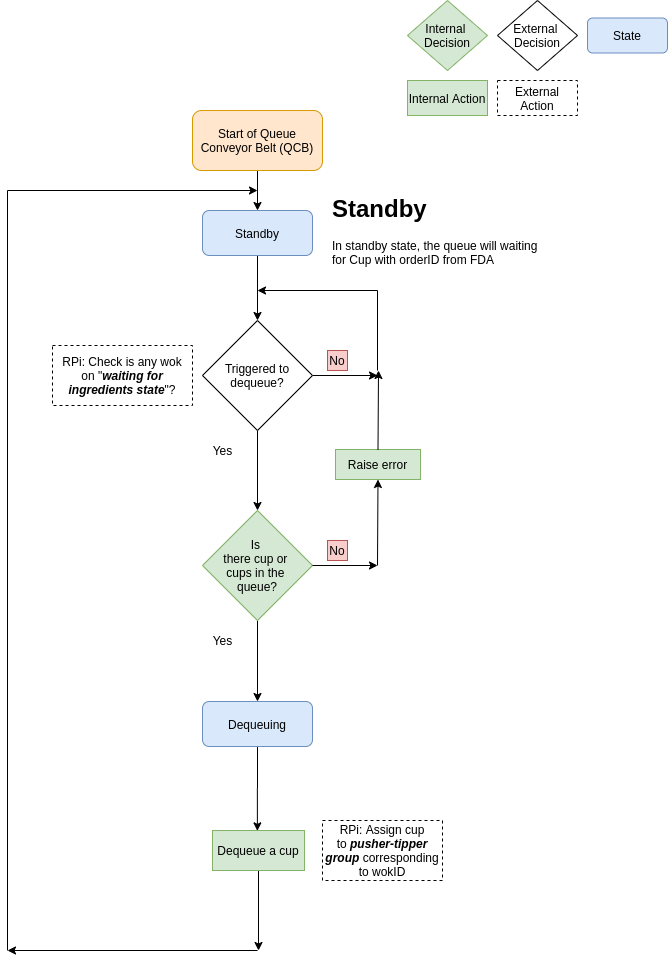
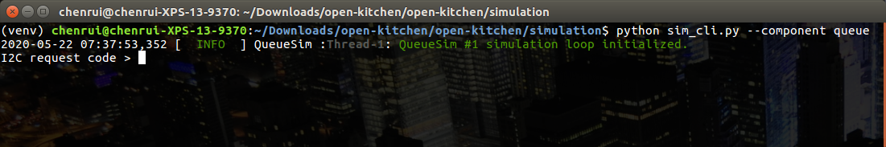
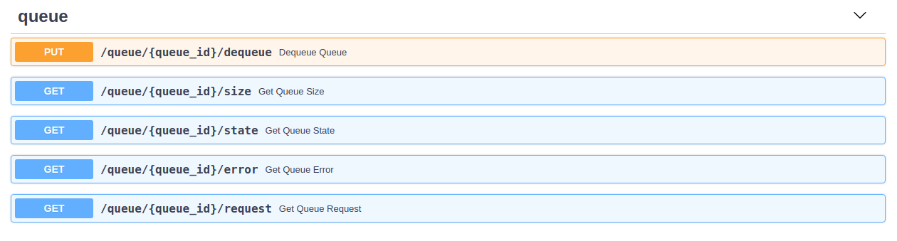

# Queue Simulation

This Queue simulation contains two parts:

1. **queue_sim**: the core hardware level - Queue simulation
2. **queue_sim_interface**: the Queue simulation on the simulated I2C interface


# Virtual Environment Setup

You will need to setup a virtual environment to run the simulation. The instructions to setup a Python
 virtual environment using `virtualenv` are as following:

```bash
virtualenv <environment_name>           # Create virtual environment
source ./<environment_name>/bin/active  # Activate virtual environment
pip install -r requirements.txt         # Install requirement at runtime
pip install -r requirements-dev.txt     # Install requirement for development
```

The `requirements.txt` and `requirements-dev.txt` are stored in the root directory of this repository.

Once the virtual environment has been setup, follow the directory `simulation` in this repository to initiate a
 simulation.

# Queue Behavior

### Queue States

The **Queue Mechanism** will have the following states

| State code | Description                |
|:-----------|:---------------------------|
| 1          | Standby                    |
| 2          | Dequeuing                  |

### Queue Errors

| Error code | Description                |
|:-----------|:---------------------------|
| 0          | No errors                  |
| 1          | No cups in the queue       |
| 2          | Not able to dequeue at current state|

### Workflow

The queue_sim is the core of hardware-level Queue simulation. It simulates the behavior
 of a Queue which will only receive I2C requests from the main controller
 (Raspberry Pi) and respond based on which requests have been sent from the main controller.


**Queue Mechanism**

The overall workflow cycle of the Queue Mechanism is explained in the next 3 points:

      1. The Queue Mechanism will initialize in the `STANDBY` state, in which the main
         controller is to trigger dequeue.

      2. After been triggered dequeue, and only if there are cups in queue, the Queue Mechanism goes into the
       `DEQUEUING` state, in which the mechanism
           - Opens up the queue and release one cup to OFTA, then close the queue.

      3. Once the dequeue is done, the Queue Mechanism will cycle back to the first step, `STANDBY` state.


### Workflow Diagram
You can check the following diagram for the Queue simulation workflow described above,




# Queue CLI

QueueSim can be executed in the terminal with the following command (you have to be in the same directory as
 the `sim_cli.py` ),

```bash
python sim_cli.py --component queue
```

After you run the previous command, you should see something like the following screenshots,



Now, you can send requests as the main controller to control the Queue. Every time you send a request, the simulation
 should respond with a code number. The following table shows the request types that can be done and the possible
  responses:

#### Main controller to Queue
| Request code | Request Description | Data type | Data Description | Response type | Response Description
|:-------------|:--------------------|:----------|:-----------------|:--------------|:--------------------
| 1            | Get component code  |           |                  | uint8         | Refer to Component codes
| 2            | Get state code      |           |                  | uint8         | Refer to [Queue States](#queue-states)
| 3            | Get error code      |           |                  | uint8         | Refer to [Queue Errors](#queue-errors)
| 4            | Get Queue request code |        |                  | unit8         | Refer to request code column at [Queue to the main controller requests](#queue-to-the-main-controller)
| 5            | Respond Queue request | uint8   |                  | uint8         | Refer to the response column at [Queue to the main controller requests](#queue-to-the-main-controller)
| 6            | Dequeue             |           |                  | unit8         | Denied (0) or Confirmed (1)
| 7            | Get queue size      |           |                  | uint8         | The current queue size


The following table represents the request types from the Queue to the main controller (Raspberry pi) and the meaning
 of each one of them.

#### Queue to the main controller
| Request code | Request Description                     | Data type | Data Description | Response type | Response Description
|:-------------|:----------------------------------------|:----------|:-----------------|:--------------|:--------------------
| 0            | No request                              |
| 1            | Queue request to trigger dequeue a cup  |           |                  |               |

 Note: You can type in `stop` in the I2C simulation terminal to exit the simulation process.


# Human Friendly Simulation

You can use the following command to launch a human friendly simulation with a RESTful API interface at `http://127
.0.0.1:8000/docs`,
```bash
python sim_api.py --current-cups-in-queue <number_of_simulated_cups_in_queue>
```

You can use the following command to bring up the API interface without specify the cups in queue. In this case, the
 number of simulated cups in queue will set to default value 0.
```bash
python sim_api.py
```

The UI should look like the screenshot below,



# The End
That's how you can use the Queue simulation.
