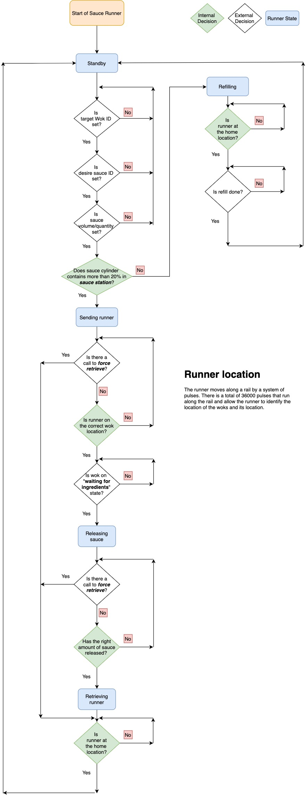
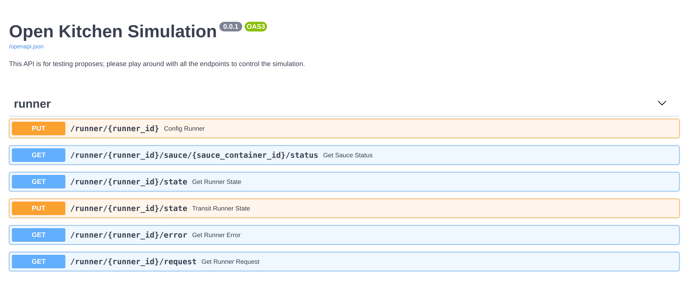

# Runner Simulation

This Runner simulation contains two parts:

1. **runner_sim**: the core hardware level - single sauce runner simulation
2. **runner_sim_interface**: the Sauce Runner(s) simulation on the simulated I2C interface


# Virtual Environment Setup

You will need to setup a virtual environment to run the simulation. The instructions to setup a python
 virtual environment using virtualenv are as following:

```bash
virtualenv <environment_name>           # Create virtual environment
source ./<environment_name>/bin/active  # Activate virtual environment
pip install -r requirements.txt         # Install requirement at runtime
pip install -r requirements-dev.txt     # Install requirement for development
```

The `requirements.txt` and `requirements-dev.txt` are stored in the main root directory of this repository.

Once the virtual environment has been setup, follow the directory `simulation` in this repository to initiate a Runner
 simulation.

# Sauce Runner Behavior

### Runner States

The runner will have the following states

| State code | Description                |
|:-----------|:---------------------------|
| 1          | Standby                    |
| 2          | Sending                    |
| 3          | Releasing                  |
| 4          | Retrieving                 |
| 5          | Refilling                  |


### Workflow

The runner_sim is the core of hardware-level, single runner simulation. It simulates the behavior of a runner which
 will only receive I2C requests from the main controller (Raspberry Pi) and respond based on which requests have been
  sent from the main controller. The overall workflow cycle of the Runner component is explained in the next 6 points:


1. The Runner will initialize in the `STANDBY` state, which will
    - Wait for the main controller to set the target wok ID.
    - Wait for the main controller to set the desire sauce ID.
    - Wait for the main controller to set the sauce release volume.

2.
    (a) After the above parameters are set and if the desired sauce load is greater than 20%, the Runner initiates the 
    `SENDING` state in which it will
    - Direct runner to the designated Wok position, and
    - Wait for the main controller to notify if Wok is on `WAITING FOR INGREDIENTS`state, aka `READY` state.

    (b). After the above parameter are set, but if the desire sauce load is NOT greater than 20%, the Runner initiates the
    `REFILLING` state in which it will
    - Wait for main controller to notify if the refilling was done.
    - Once the main controller notifies that refilling is done, the Runner goes back to `STANDBY` state (cycle
back to the first step).

3.
    (a). Once the main controller notifies that the designated Wok is ready to receive sauce, the Runner positions itself on 
    top of the wok and switches to the `RELEASING` state, in which it will
    - Release the desired sauce by the volume set.

4.
    (a). Once the desired sauce volume has been released, the Runner will enter the `RETRIEVING` state which will
    - Move the Runner back to the home position.
    
5. Finally, once the Runner arrives to the home position, it will switch  into the `STANDBY` state

6. The Runner will cycle back to the first step


### Workflow Diagram
You can check the following diagram for the runner simulation workflow discribed above,




# RunnerSim CLI

RunnerSim can be executed in the terminal with the following command ( you have to be in the same directory as the
 `sim_cli.py` ),

```bash
python sim_cli.py
```

After you run the previous command, you should see something like the following screenshot,


Now, you can send requests as the main controller to control the Runner. Every time you send a
 request, the Runner should respond with a code number. The following table shows the request types that can be done and
  the possible responses:

#### Main controller to Runner
| Request code | Request Description | Data  | Response | Response Description
|:-------------|:--------------------|:------|:---------|:--------------------
| 1            | Get component code  |       | 1        | Wok component
|              |                     |       | 2        | Ingredient dispenser component
|              |                     |       | 3        | Sauce runner component
|              |                     |       | 4        | Transporter (Conveyor) component
| 2            | Get state code      |       | 1        | STANDBY state
|              |                     |       | 2        | SENDING runner state
|              |                     |       | 3        | RELEASING state
|              |                     |       | 4        | RETRIEVING runner state
|              |                     |       | 5        | REFILLING state
| 3            | Get error code      |       | 0        | No errors
|              |                     |       | 1        | Error: need refill
|              |                     |       | 2        | Error: not able to retrieve at current state
| 4            | Get Runner request code |       | 0        | Runner no request
|              |                     |       | 1        | Runner request to set target Wok ID
|              |                     |       | 2        | Runner request to set desire sauce bag ID
|              |                     |       | 3        | Runner request to set release volume
|              |                     |       | 4        | Runner request to notify if refill is done
|              |                     |       | 5        | Runner request to notify if wok is ready
| 5            | Respond Runner request | uint8 | 0        | Runner failed to save data and/or not able to setup
|              |                     |       | 1        | Runner successfully save data and/or setup
| 6            | Force retrieve runner| uint8 | 0        | Failed
|              |                     |       | 1        | Successfully
| 7            | (Re)Set target wok ID | uint8 | 0        | Failed
|              |                     |       | 1        | Successfully
| 8            | (Re)Set desire sauce ID | uint8 | 0        | Failed
|              |                     |       | 1        | Successfully
| 9            | (Re)Set release volume | uint8 | 0        | Failed
|              |                     |       | 1        | Successfully
| 10           | Notify refill done  | uint8 | 0        | Failed
|              |                     |       | 1        | Successfully
| 11           | Notify Wok is ready | uint8 | 0        | Failed
|              |                     |       | 1        | Successfully
| 12           | Get sauce load      | uint8 | 0        | Failed
|              |                     |       | other    | The current load


The following table represents the request types from the Runner to the main controller (Raspberry pi) and the
 meanings of each one of them.

#### Runner to the main controller
| Request code | Request Description                     | Data  | Response | Response Description
|:-------------|:----------------------------------------|:------|:---------|:--------------------
| 0            | No request                              |
| 1            | Request to set target Wok ID            |       | uint8    | Heat degrees
| 2            | Request to set desire sauce bag ID      |       | uint8    | Cooking duration in seconds
| 3            | Request to set release volume           |       | string   | Order id
| 4            | Request to confirm if refill is done    |       | 0        | Denied
|              |                                         |       | 1        | Confirmed
| 5            | Request to confirm if wok is ready      |       | 0        | Denied
|              |                                         |       | 1        | Confirmed

 Note: You can type in `stop` in the I2C simulation terminal to exit the simulation process.


# Human Friendly Simulation

You can using the following command to launch a human friendly simulation with a RESTful API interface at `http://127
.0.0.1:8000/docs`,
```bash
python sim_api.py --sauce-bag-num <number_of_simulated_sauce_bags>
```

You can also using the following command to bring up the API interface without specify the sauce bag number. In this case, the sace number will set to default value 4.
```bash
python sim_api.py
```

The UI should look like the screenshot below,



# The End
That's how you can use Runner simulation.
